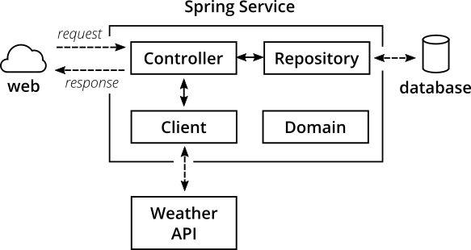

# TESTS

## Types


## Mike Cohn`s pyramid


## Why? How? 


## Complex view of our app


## More complex view of our app



## Unit tests view


## Integration tests view


## User interface tests view


## Mocha life hook process
```
|
spawn child process
|
|--------------> inside child process
  process and apply options
  |
  run spec file/s
  |
  |--------------> per spec file
    suite callbacks (e.g., 'describe')
    |
    'before' root-level pre-hook
    |
    'before' pre-hook
    |
    |--------------> per test
      'beforeEach' root-level pre-hook
      |
      'beforeEach' pre-hook
      |
      test callbacks (e.g., 'it')
      |
      'afterEach' post-hook
      |
      'afterEach' root-level post-hook
    |<-------------- per test end
    |
    'after' post-hook
    |
    'after' root-level post-hooks
  |<-------------- per spec file end
|<-------------- inside child process end
```