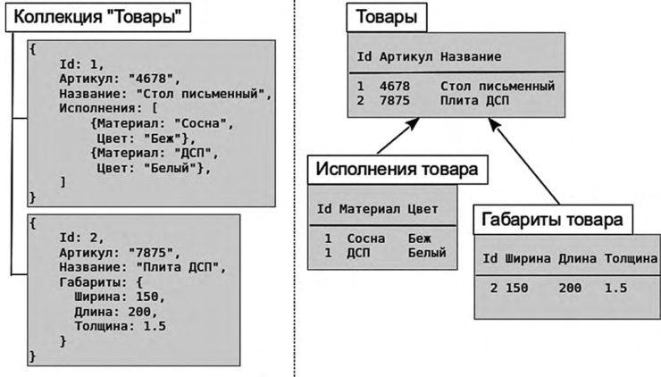

# nodejs_lessons

## Реляционная база VS Неряляционная база данных

### Реляционная (MySql, PostgreSql)
- Разбита на таблицы
- Имеет строгую типизацию полей
- Имеет связи между таблица (ключи)
- Работает быстрее нереляционных при получении данных одной  
сущности разбитой на несколько таблиц

### Нереляционная (MongoDB)
- Хранит все в одном документе
- Не имеет строгой типизации
- Не имеет связей
- Работает быстрее реляционных на больших обьемах данных

mongodb+srv://test_user_god:<password>@cluster0.mbbol.mongodb.net/<dbname>?retryWrites=true&w=majority

https://docs.mongodb.com/manual
https://docs.mongodb.com/manual/reference/operator/query/
https://mongodb.github.io/node-mongodb-native/2.0/api/Collection.html